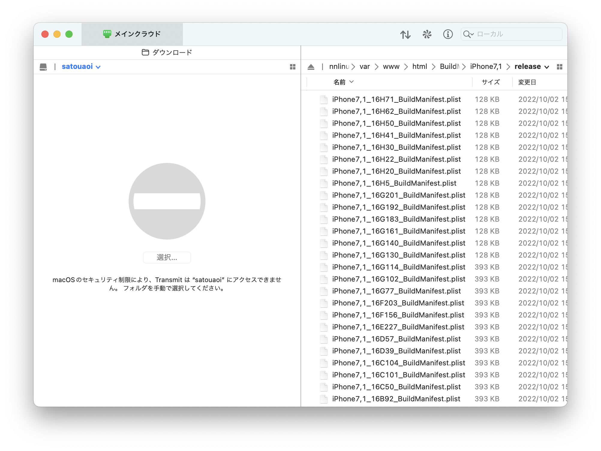

# BuildManifest downloader

指定したiDeviceで使用される全バージョンのBuildManifestを簡単にダウンロードすることができます。  
必要なコマンドやファイルはすべてスクリプトが自動で用意します

# 対応OS

Intel_MacOS(Arm_Macでは未検証). 
x86_64 Debian系OS

# 実行する前に

MacOSの場合は予めHomebrewを導入してください。  
導入していない場合は実行中に必要なコマンドを入力するよう指示をすることがあります  
このスクリプトを実行したことによる故障や損害について開発者は責任を負いかねます

# 実行の仕方

以下のコマンドの引数に[device MODEL]を指定し実行します

```sh
bash <(curl -s https://raw.githubusercontent.com/Aoi-Developer/BuildManifest-downloader/main/main.sh) [device MODEL]
```

おーしまい！ 



# Credits 

@tihmstar  
https://github.com/tihmstar/partialZipBrowser

# 取得元  
https://github.com/m1stadev/ios-beta-api  
https://api.ipsw.me/

